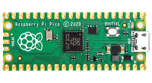

# pico-temp-fan

# Temperature-Controlled Fan with Raspberry Pi Pico

## Overview
This project implements a temperature-controlled fan using the Raspberry Pi Pico. The system dynamically adjusts the fan speed based on the current temperature. 
The temperature is monitored in real-time and displayed on a seven-segment display, offering both functional feedback and a user-friendly interface.

---

## Features

1. **Temperature Monitoring:**
   - Real-time temperature readings are captured using a temperature sensor (e.g., LM35, DS18B20, or DHT11/22).

2. **PWM Fan Control:**
   - The fan speed is controlled via Pulse Width Modulation (PWM), ensuring smooth speed transitions.

3. **Live Display:**
   - Temperature values are displayed on a seven-segment display for easy monitoring.

4. **Dynamic Adjustments:**
   - Fan speed increases as the temperature rises, ensuring efficient cooling.

5. **Compact and Efficient Design:**
   - Built around the Raspberry Pi Pico, leveraging its GPIO pins and hardware PWM capabilities.

---

## Components

1. **Microcontroller:**
   - Raspberry Pi Pico

2. **Sensors:**
   - Temperature sensor (e.g., LM35 or DHT22)

3. **Fan:**
   - DC fan compatible with PWM

4. **Display:**
   - Seven-segment display (common anode or common cathode)

5. **Additional Electronics:**
   - Resistors
   - Transistor (for fan control if necessary)
   - Diodes (flyback diode for fan motor)
   - Potentiometer (for optional manual fan speed adjustment)

---

## Software

The software for this project is written in C/C++ or MicroPython and includes:

1. **Temperature Reading Logic:**
   - Reads sensor data and converts it to temperature values.

2. **PWM Control:**
   - Configures PWM channels on the Pico to adjust fan speed based on temperature.

3. **Display Driver:**
   - Handles the seven-segment display for real-time temperature output.

4. **Threshold Logic (Optional):**
   - Sets specific temperature thresholds for triggering fan speed changes or alarms.

---

## How It Works

1. The temperature sensor continuously measures the ambient temperature.
2. The sensor data is processed by the Pico to determine the required fan speed.
3. The Pico adjusts the PWM duty cycle to control the fan speed accordingly.
4. The current temperature is displayed on the seven-segment display.
5. The system reacts dynamically to temperature changes, ensuring optimal cooling efficiency.

---

## Future Scope

1. Add a buzzer for over-temperature alerts.
2. Implement a user interface for customizable temperature thresholds.
3. Add Wi-Fi or Bluetooth support for remote monitoring and control.
4. Expand the display to include a larger screen for more detailed information.

---

## Acknowledgments

This project is inspired by the need for efficient and responsive cooling systems in electronics and small-scale applications. The Raspberry Pi Pico provides an affordable and versatile platform for such projects.

